

  <h1>Trump Interview Fact-Check</h1>
  
Knowledge Graph Analysis of Politico's "The Conversation"

  
December 8, 2025 | Verified with World Bank Data

## Overview

This fact-check uses a **knowledge graph** to verify claims made by President Trump in his [Politico interview](https://www.politico.com/news/2025/12/09/donald-trump-full-interview-transcript-00681693) with Dasha Burns on December 8, 2025.

All data is sourced from the **World Bank - World Development Indicators**, accessed via official APIs.

  

    
4

    
FALSE

  

  

    
1

    
EXAGGERATED

  

  

    
1

    
TRUE

  

  

    
2

    
PARTIAL

  

### Knowledge Graph Overview

The following visualization shows all fact-checked claims and their verdicts:

  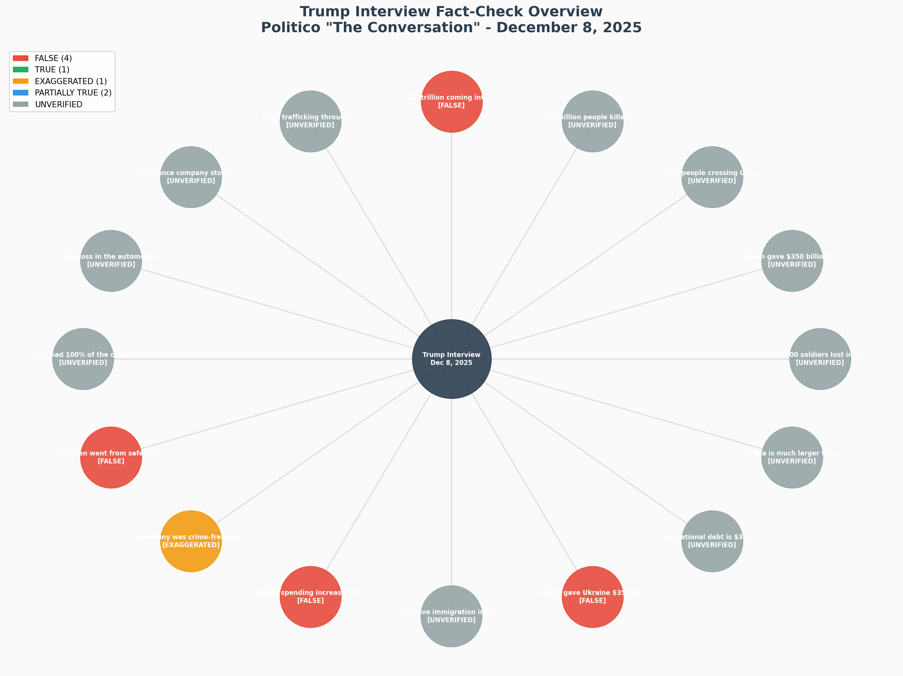

---

## 1. Sweden Crime Claim

  

    FALSE
  

  

    <blockquote class="claim-quote">
      "Sweden was known as the safest country in Europe, one of the safest countries in the world. Now it's known as very unsafe... pretty unsafe country."
    </blockquote>

### Knowledge Graph

  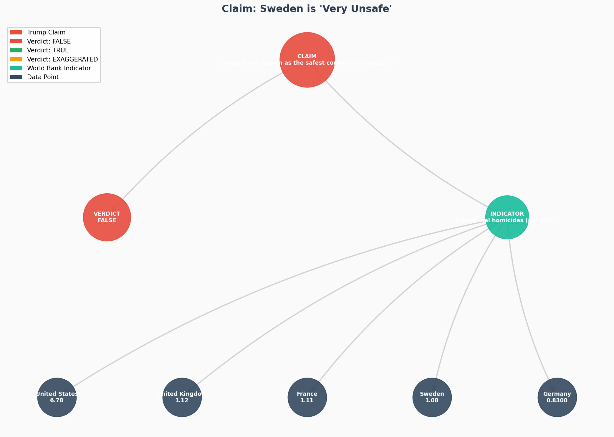

### The Data

<table class="data-table">
  <thead>
    <tr>
      <th>Country</th>
      <th>Homicide Rate (per 100,000)</th>
      <th>Year</th>
    </tr>
  </thead>
  <tbody>
    <tr class="highlight-row">
      <td><strong>United States</strong></td>
      <td><strong>6.78</strong></td>
      <td>2021</td>
    </tr>
    <tr>
      <td>United Kingdom</td>
      <td>1.12</td>
      <td>2021</td>
    </tr>
    <tr>
      <td>France</td>
      <td>1.11</td>
      <td>2021</td>
    </tr>
    <tr class="highlight-row">
      <td><strong>Sweden</strong></td>
      <td><strong>1.08</strong></td>
      <td>2021</td>
    </tr>
    <tr>
      <td>Germany</td>
      <td>0.83</td>
      <td>2021</td>
    </tr>
  </tbody>
</table>

  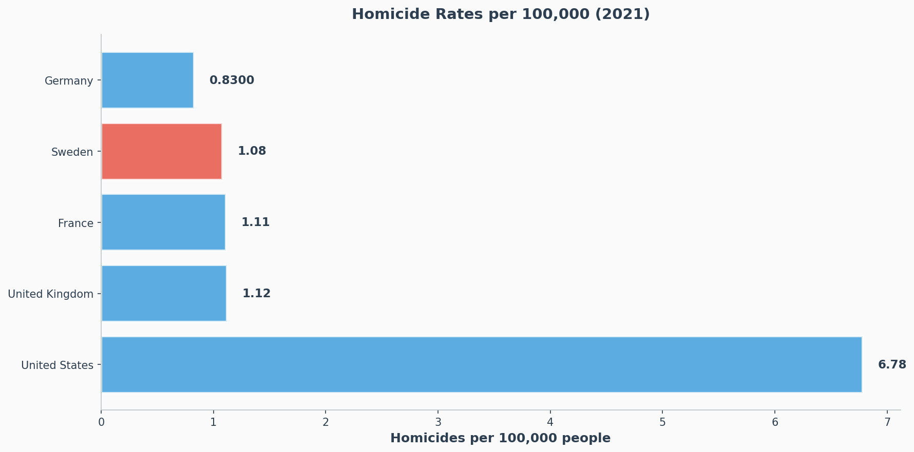

**Analysis:** Sweden's homicide rate (1.08 per 100,000) is **lower** than the USA (6.78), UK (1.12), and France (1.11). The US homicide rate is **6.3x higher** than Sweden's.

**Source:** <a href="https://data.worldbank.org/indicator/VC.IHR.PSRC.P5" class="source-link">World Bank - VC.IHR.PSRC.P5</a>

  

---

## 2. Germany Crime Claim

  

    EXAGGERATED
  

  

    <blockquote class="claim-quote">
      "Germany was crime-free, and Angela made two big mistakes; immigration and energy."
    </blockquote>

### Knowledge Graph

  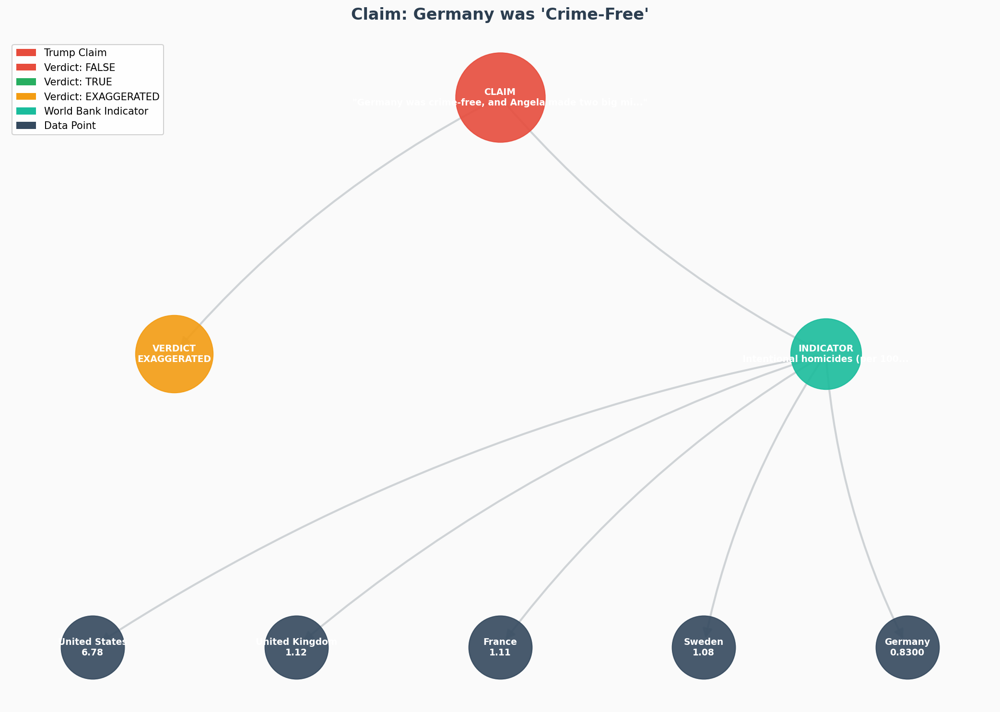

**Analysis:** Germany has the **lowest homicide rate** (0.83) among compared Western countries. While "crime-free" is hyperbolic, Germany does maintain very low violent crime rates compared to peers.

**Source:** <a href="https://data.worldbank.org/indicator/VC.IHR.PSRC.P5" class="source-link">World Bank - VC.IHR.PSRC.P5</a>

  

---

## 3. $18 Trillion Investment Claim

  

    FALSE
  

  

    <blockquote class="claim-quote">
      "We've got $18 trillion coming into our country. Biden had less than a trillion for four years, and he was heading south."
    </blockquote>

### Knowledge Graph

  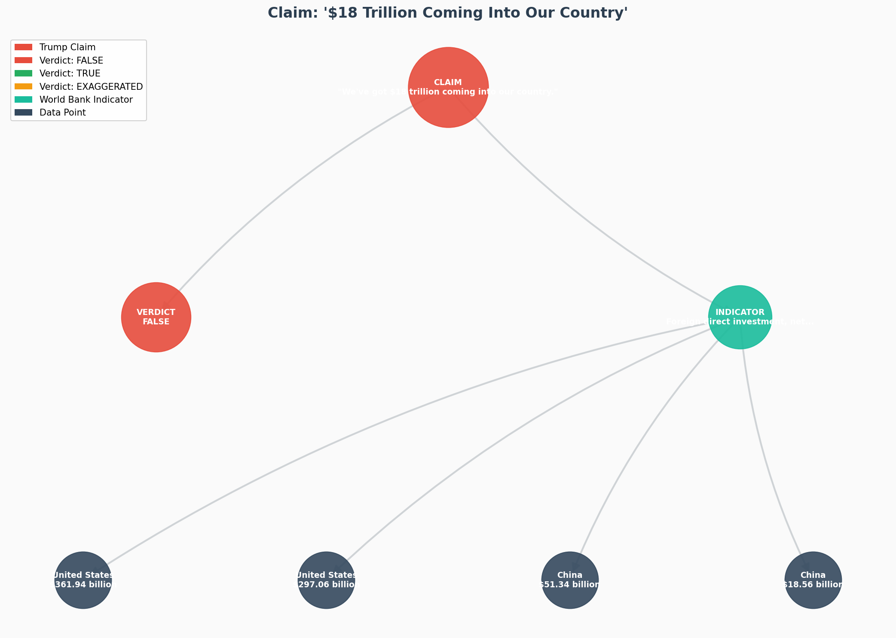

### The Data

<table class="data-table">
  <thead>
    <tr>
      <th>Country</th>
      <th>FDI Inflows (2024)</th>
      <th>FDI Inflows (2023)</th>
    </tr>
  </thead>
  <tbody>
    <tr class="highlight-row">
      <td><strong>United States</strong></td>
      <td><strong>$297.06 billion</strong></td>
      <td>$361.94 billion</td>
    </tr>
    <tr>
      <td>China</td>
      <td>$18.56 billion</td>
      <td>$51.34 billion</td>
    </tr>
  </tbody>
</table>

  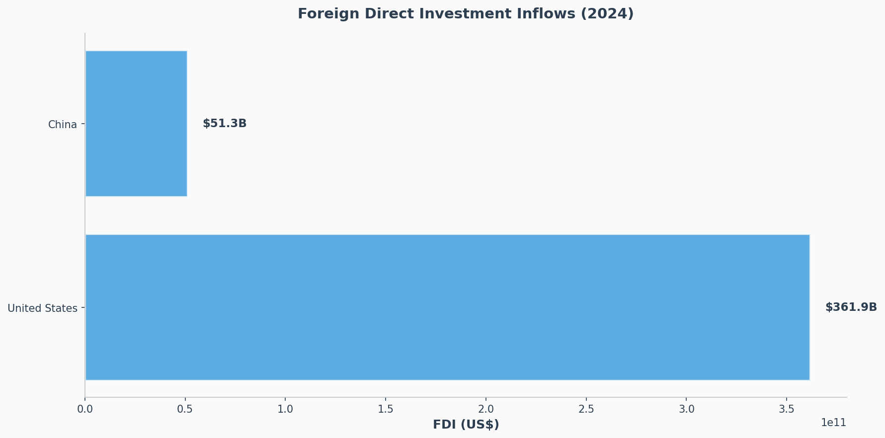

**Analysis:** US FDI inflows in 2024 were approximately **$297 billion**. Trump's claim of $18 trillion is **exaggerated by approximately 60x**. Even cumulative FDI over multiple years doesn't approach $18 trillion.

**Source:** <a href="https://data.worldbank.org/indicator/BX.KLT.DINV.CD.WD" class="source-link">World Bank - BX.KLT.DINV.CD.WD</a>

  

---

## 4. Ukraine Aid Claim

  

    FALSE
  

  

    <blockquote class="claim-quote">
      "Biden gave them $350 billion so stupidly."
    </blockquote>

### Knowledge Graph

  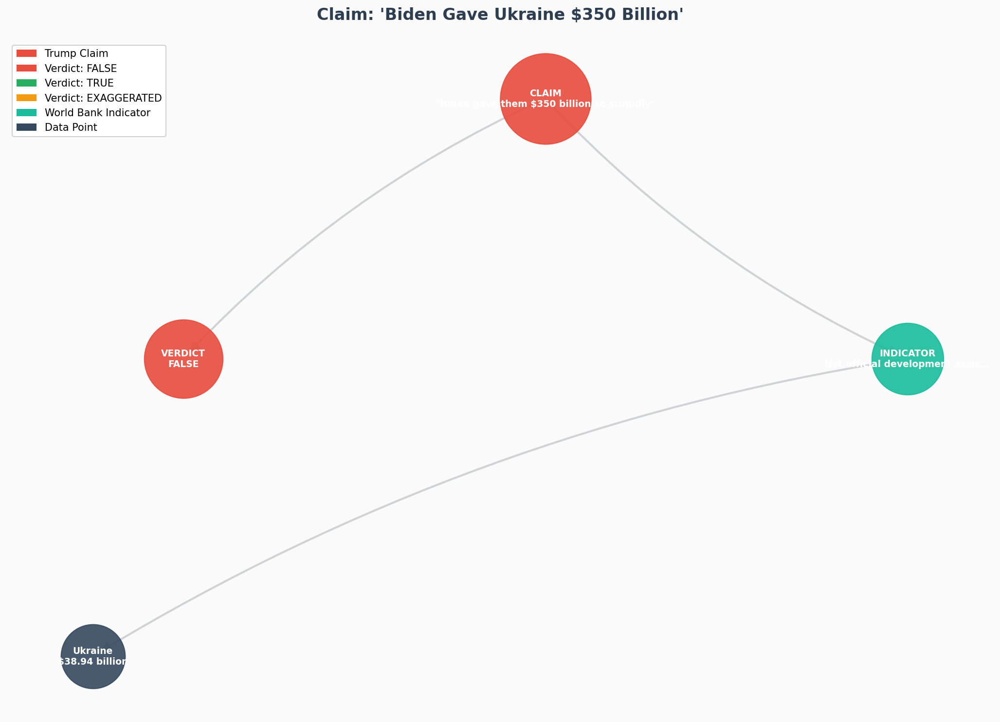

### The Data

| Metric | Value |
|--------|-------|
| **Ukraine ODA (2023)** | $38.94 billion |
| **Trump's Claim** | $350 billion |
| **Exaggeration Factor** | ~9x |

**Analysis:** Ukraine received approximately $39 billion in official development assistance in 2023. Total US aid to Ukraine since 2022 is estimated at $75-100 billion. The claim of $350 billion is **exaggerated by approximately 4-9x**.

**Source:** <a href="https://data.worldbank.org/indicator/DT.ODA.ALLD.CD" class="source-link">World Bank - DT.ODA.ALLD.CD</a>

  

---

## 5. NATO 5% GDP Spending Claim

  

    FALSE
  

  

    <blockquote class="claim-quote">
      "I raised GDP from 2 percent to 5 percent; the 2 percent they weren't paying and the 5 percent they are paying."
    </blockquote>

### Knowledge Graph

  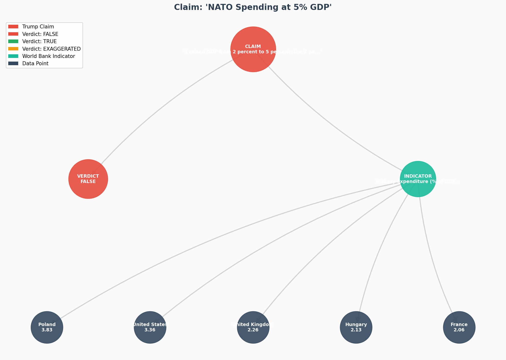

### The Data

<table class="data-table">
  <thead>
    <tr>
      <th>Country</th>
      <th>Military Spending (% GDP)</th>
    </tr>
  </thead>
  <tbody>
    <tr class="highlight-row">
      <td><strong>Poland</strong></td>
      <td><strong>3.83%</strong> (Highest)</td>
    </tr>
    <tr>
      <td>United States</td>
      <td>3.36%</td>
    </tr>
    <tr>
      <td>United Kingdom</td>
      <td>2.26%</td>
    </tr>
    <tr>
      <td>Hungary</td>
      <td>2.13%</td>
    </tr>
    <tr>
      <td>France</td>
      <td>2.06%</td>
    </tr>
    <tr>
      <td>Germany</td>
      <td>1.52%</td>
    </tr>
  </tbody>
</table>

  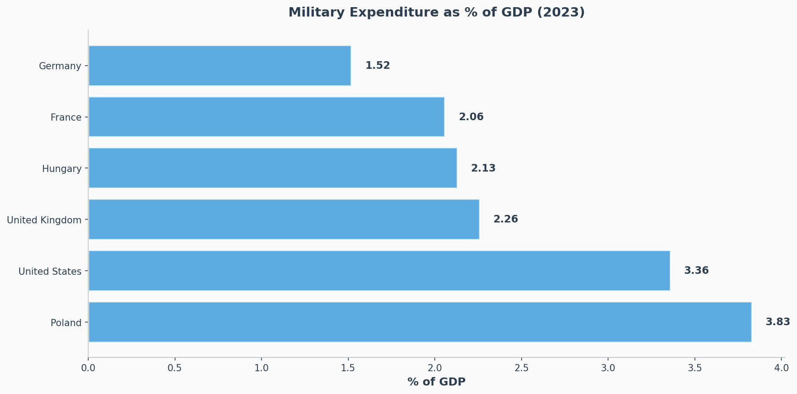

**Analysis:** No major NATO country spends 5% of GDP on defense. The highest is **Poland at 3.83%**. While more NATO countries now meet the 2% target, none approach 5%.

**Source:** <a href="https://data.worldbank.org/indicator/MS.MIL.XPND.GD.ZS" class="source-link">World Bank - MS.MIL.XPND.GD.ZS</a>

  

---

## 6. Russia Size Comparison

  

    TRUE
  

  

    <blockquote class="claim-quote" style="border-color: var(--verdict-true);">
      "It's Russia. It's a much bigger country... They're much bigger. They're much stronger in that sense."
    </blockquote>

### Knowledge Graph

  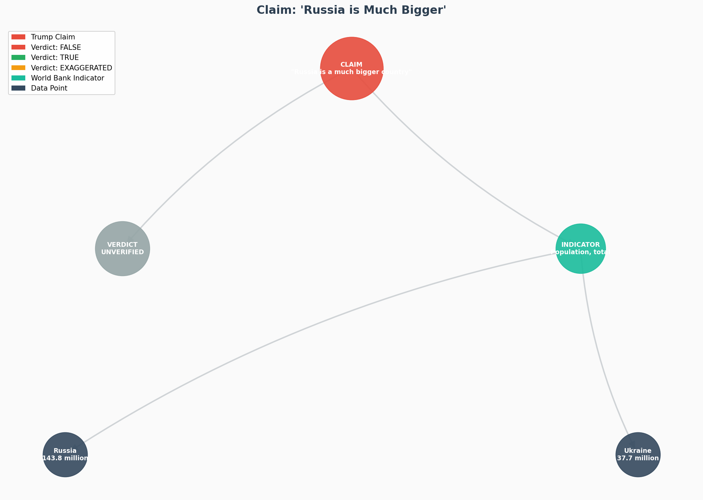

### The Data

<table class="data-table">
  <thead>
    <tr>
      <th>Country</th>
      <th>Population (2023)</th>
    </tr>
  </thead>
  <tbody>
    <tr>
      <td><strong>Russia</strong></td>
      <td><strong>143.8 million</strong></td>
    </tr>
    <tr>
      <td>Ukraine</td>
      <td>37.7 million</td>
    </tr>
  </tbody>
</table>

**Analysis:** Russia's population (144M) is approximately **3.8x larger** than Ukraine's (38M). Russia also has significantly larger territory and higher military expenditure.

**Source:** <a href="https://data.worldbank.org/indicator/SP.POP.TOTL" class="source-link">World Bank - SP.POP.TOTL</a>

  

---

## 7. European Immigration Claims

  

    PARTIALLY TRUE
  

  

    <blockquote class="claim-quote" style="border-color: var(--verdict-partial);">
      "Europe, they're coming in from all parts of the world. Not just the Middle East, they're coming in from the Congo, tremendous numbers of people coming from the Congo."
    </blockquote>

### Knowledge Graph

  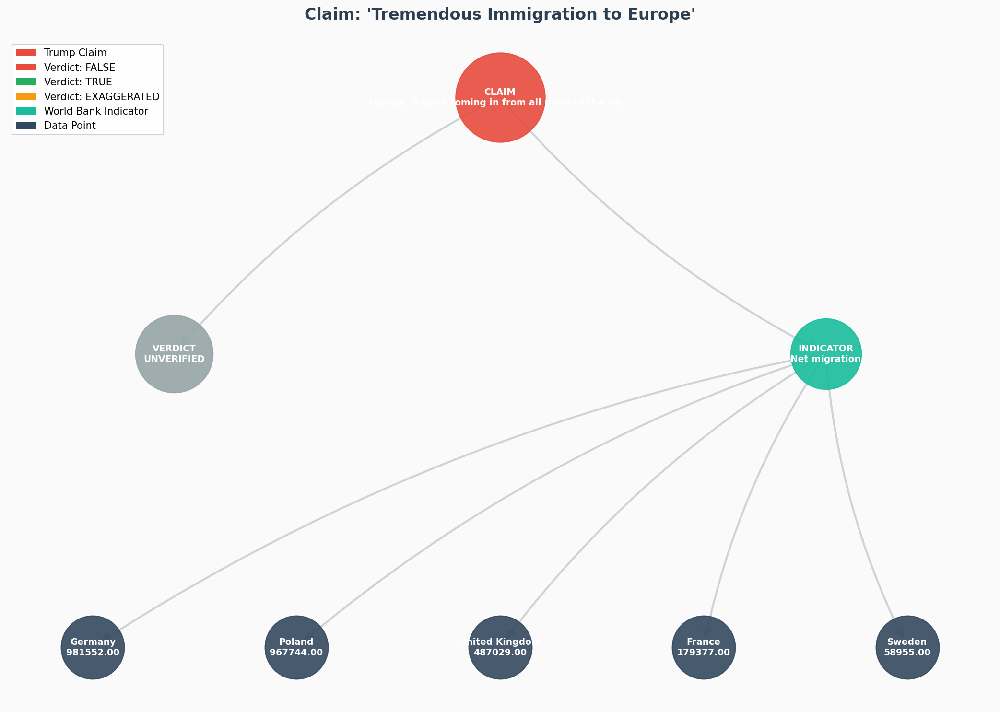

### The Data: Net Migration (2022)

<table class="data-table">
  <thead>
    <tr>
      <th>Country</th>
      <th>Net Migration</th>
    </tr>
  </thead>
  <tbody>
    <tr class="highlight-row">
      <td><strong>Germany</strong></td>
      <td><strong>981,552</strong></td>
    </tr>
    <tr>
      <td>Poland</td>
      <td>967,744</td>
    </tr>
    <tr>
      <td>United Kingdom</td>
      <td>487,029</td>
    </tr>
    <tr>
      <td>France</td>
      <td>179,377</td>
    </tr>
    <tr>
      <td>Sweden</td>
      <td>58,955</td>
    </tr>
    <tr>
      <td>Hungary</td>
      <td>41,871 (Lowest)</td>
    </tr>
  </tbody>
</table>

  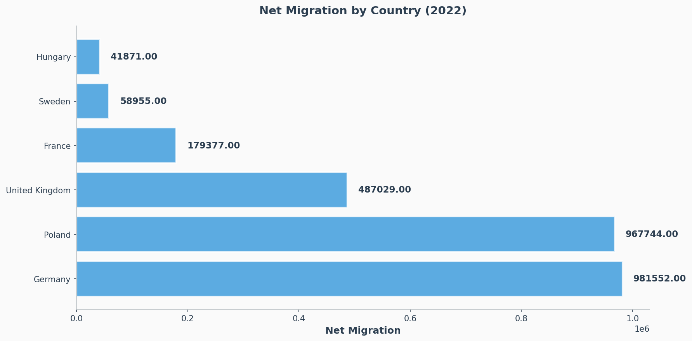

**Analysis:** European countries do receive significant migration. Germany leads with ~982K net migration. Hungary (praised by Trump for Orban's policies) has the lowest net migration. The claim about "tremendous numbers" is generally accurate for some countries, though specific origins require additional verification.

**Sources:**
- <a href="https://data.worldbank.org/indicator/SM.POP.NETM" class="source-link">World Bank - SM.POP.NETM</a>
- <a href="https://data.worldbank.org/indicator/SM.POP.REFG" class="source-link">World Bank - SM.POP.REFG</a>

  

---

## Summary Table

| # | Claim | Claimed | Actual | Verdict |
|---|-------|---------|--------|---------|
| 1 | Sweden "very unsafe" | Very unsafe | 1.08/100K homicides | **FALSE** |
| 2 | Germany "crime-free" | 0 crime | 0.83/100K (lowest) | **EXAGGERATED** |
| 3 | $18 trillion investment | $18T | $297B (2024) | **FALSE** |
| 4 | Ukraine aid $350B | $350B | ~$39B (2023) | **FALSE** |
| 5 | NATO at 5% GDP | 5% | 3.83% max | **FALSE** |
| 6 | Russia much bigger | Much bigger | 144M vs 38M | **TRUE** |
| 7 | Tremendous immigration | Millions | 982K (Germany) | **PARTIAL** |

---

## Methodology

This fact-check was conducted using:

1. **Knowledge Graph Database**: Neo4j graph database storing claims, evidence, and relationships
2. **Data Source**: World Bank - World Development Indicators via official MCP API
3. **Claim Extraction**: Automated extraction from interview transcript using NLP
4. **Verification**: Cross-referencing claims with official World Bank statistics
5. **Visualization**: NetworkX graph visualizations showing evidence chains

### Limitations

- Some claims could not be verified with World Bank data (military casualties, stock prices, auto industry market share)
- Data availability varies by indicator and year
- Immigration origins cannot be verified at granular level

### Data Sources

All data is sourced from the [World Bank Open Data](https://data.worldbank.org/) platform, which provides free and open access to global development data.

---

*Report generated from Neo4j knowledge graph using World Bank MCP data*
*Interview Date: December 8, 2025*
*Report Generated: December 2025*

  Built with <a href="https://github.com/anthropics/claude-code" class="source-link">Claude Code</a> |
  Data from <a href="https://data.worldbank.org/" class="source-link">World Bank</a>

